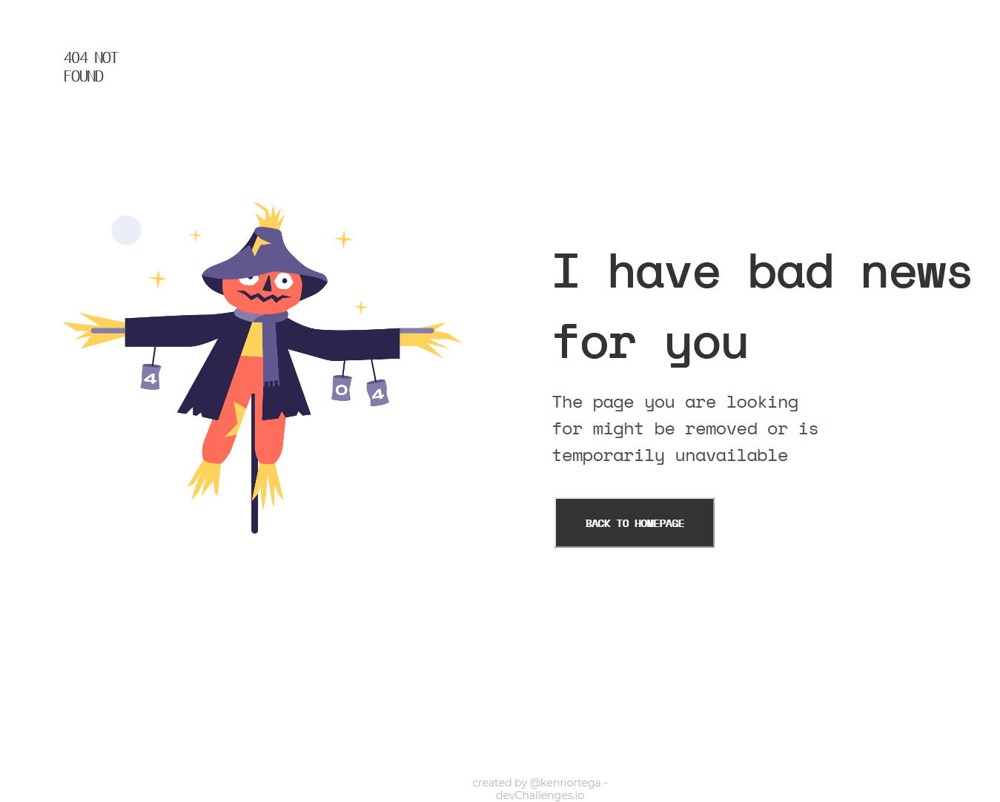

<!-- Please update value in the {}  -->

<h1 align="center">Page 404 challenge</h1>

   Solution for a challenge from  <a href="http://devchallenges.io" target="_blank">Devchallenges.io</a>.

  <h3>
    <a href="https://page404-kenriortega.vercel.app">
      Demo
    </a>
     | 
    <a href="https://github.com/kenriortega/page404">
      Solution
    </a>
     | 
    <a href="https://devchallenges.io/challenges/wBunSb7FPrIepJZAg0sY">
      Challenge
    </a>
  </h3>

<!-- TABLE OF CONTENTS -->

## Table of Contents

- [Overview](#overview)
  - [Built With](#built-with)
- [Features](#features)
- [Contact](#contact)
- [Acknowledgements](#acknowledgements)

<!-- OVERVIEW -->

## Overview

In this demo the user can see the simple web site with content 404 not found, this page it`s used when the content are unavilable, or dose not exsit.

 My experience developing this project was awesome, becouse I`m new in the frontend development, and some time the people say that the backend is hard, but the frontend is very hard.

 Making this demo i learned how i can work with figma an following the step to focus in the main task, also i learned features realted to css, such as:
  - import external fonts
  - custom properties (variables in css)

I improved my skill with react.js framework and i lose the fear to make css code without any css framework.

### Built With

<!-- This section should list any major frameworks that you built your project using. Here are a few examples.-->

- [React.js](https://reactjs.org/)

## Available Scripts

In the project directory, you can run:

### `npm start`

Runs the app in the development mode.\
Open [http://localhost:3000](http://localhost:3000) to view it in the browser.

The page will reload if you make edits.\
You will also see any lint errors in the console.

### `npm test`

Launches the test runner in the interactive watch mode.\
See the section about [running tests](https://facebook.github.io/create-react-app/docs/running-tests) for more information.

### `npm run build`

Builds the app for production to the `build` folder.\
It correctly bundles React in production mode and optimizes the build for the best performance.

The build is minified and the filenames include the hashes.\
Your app is ready to be deployed!

See the section about [deployment](https://facebook.github.io/create-react-app/docs/deployment) for more information.

### deploy
This section has moved here: [https://facebook.github.io/create-react-app/docs/deployment](https://facebook.github.io/create-react-app/docs/deployment)
## Features

<!-- List the features of your application or follow the template. Don't share the figma file here :) -->

This application/site was created as a submission to a [DevChallenges](https://devchallenges.io/challenges) challenge. The [challenge](https://devchallenges.io/challenges/wBunSb7FPrIepJZAg0sY) was to build an application to complete the given user stories.

## Acknowledgements

<!-- This section should list any articles or add-ons/plugins that helps you to complete the project. This is optional but it will help you in the future. For exmpale -->

- [Create React App](https://github.com/facebook/create-react-app)
- [css-tricks - overflow wrap word](https://css-tricks.com/almanac/properties/o/overflow-wrap/)
- [adding-fonts to create-react-app](https://dev.to/annequinkenstein/adding-fonts-to-create-react-app-3ed7)

## Contact

- Website not yet
- GitHub [@kenriortega](https://{github.com/kenriortega})
- Twitter [@kenriortega](https://{twitter.com/kenriortega})

